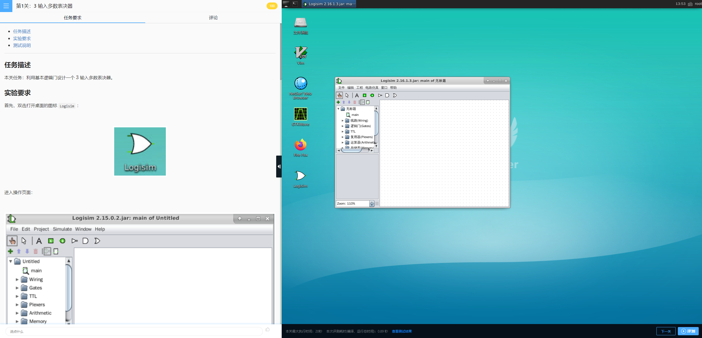

# 快速入门

进入实训，点击屏幕上的Logisim，出现如下界面（以关卡：3 输入多数表决器为例）。

- 根据左侧的实验引导完成实验。
- 为了实验能够正确评测，注意:
  - 在电路编辑模式下，不要修改引脚的位置和标签，也不要添加引脚。
  - 在封装编辑模式下，不要修改电路封装。
  - 在要求的子电路中完成实验。
  - 不要删减或添加子电路。
- 完成电路的设计之后，点击右下角的“评测”进行实验评测，评测检查电路的部分（或者全部）的真值表。