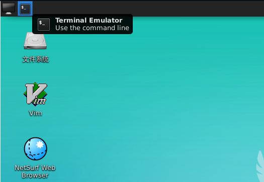

# 实验平台相关问题

### 一不小心用`rm -rf /`把虚拟环境删了，怎么办？

可以在虚拟环境的工具栏中重置环境。

首先在右上角找到工具栏，


然后点击重置实训。


### 我在本地做了一个模块，怎么把这个文件拷贝到虚拟环境里？

你不能直接拷贝到虚拟环境里。这主要是出于学术诚信方面的考虑（你懂的）。

> Hint: 如果你很细心，应该会发现logisim的circ文件是一个UTF-8编码的xml文件。
这里有一个稍微麻烦一点的方法：点击“重置实训”下面的“复制粘贴”，你可以使用剪贴板。
借此可以间接实现文件拷贝。

### 不小心删除了子电路or修改了引脚，改不回去了，怎么办？

可以用git回退到以前的版本。先在左上角打开终端：



执行以下命令：

```bash
cd /data/workspace/myshixun   # change directory
git reset --hard HEAD         # HEAD is the pointer to the current branch reference
```

可以回退到做实验之前的状态。
此外，也可以改变`git reset`的参数，使其只恢复某个特定的的文件，具体怎样操作就需要你RTFM/STFW了。