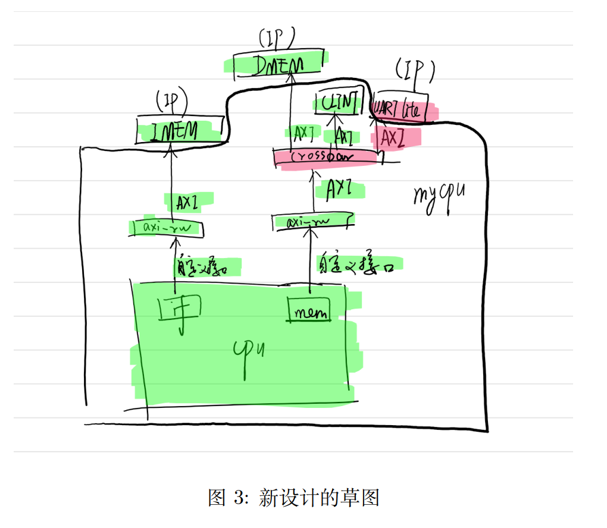
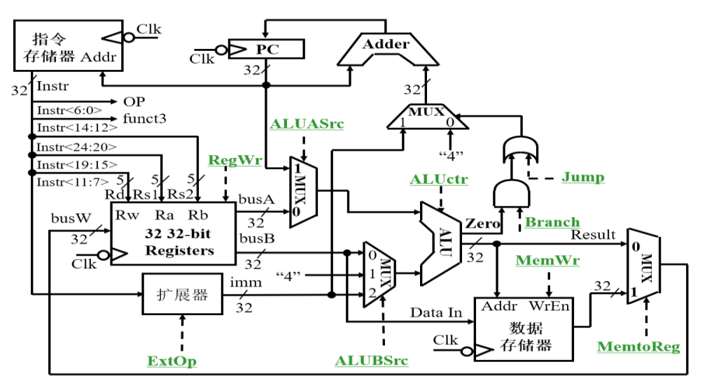

# 怎样写实验报告

这里以[实验一](https://github.com/NJU-DL-CO-TA/DLCOdoc/blob/main/assets/%E5%AE%9E%E9%AA%8C1%20%E5%9F%BA%E6%9C%AC%E9%80%BB%E8%BE%91%E9%83%A8%E4%BB%B6%E8%AE%BE%E8%AE%A1.pdf)为例，讲一讲怎么写实验报告。
本文综合了群文件里的[这个文档](https://github.com/NJU-DL-CO-TA/DLCOdoc/blob/main/assets/%E5%AE%9E%E9%AA%8C%E6%8A%A5%E5%91%8A%E4%B8%BB%E8%A6%81%E5%86%85%E5%AE%B9.pdf)与群文件里的实验报告模板。
以下给出的是实验报告的部分 Latex 代码。
你也可以用 MS Word、markdown这样的工具完成实验报告。
需要注意：

- 建议以 pdf 格式提交，以避免兼容性问题。
- 实验报告中的图片，不要出现手机拍屏幕的现象。
- 以下未标明“可以不写”的内容一定都要写。

## 实验目的（可以不写）

可以直接复制粘贴。


```Latex
\section{实验目的}

\begin{enumerate}
  \item 熟悉 Logisim 软件的使用方法；
  \item 掌握使用晶体管实现基本逻辑部件的方法；
  \item 利用基础元器件库设计简单数字电路；
  \item 了解子电路的设计和应用；
  \item 掌握分线器、隧道、探针等 Logisim 组件的使用方法。
\end{enumerate}
```

我们不会因为你写了这个而给你加分。

## 实验环境（可以不写）

可以直接复制粘贴。


```Latex
\section{实验环境}

Logisim：https://github.com/Logisim-Ita/Logisim
```

我们不会因为你写了这个而给你加分。

## 实验内容

例如，利用基本逻辑门设计一个 3 输入多数表决器：

```Latex
\section{实验内容}
\subsection{利用基本逻辑门设计一个3输入多数表决器}
```

### 整体方案设计

```Latex
\subsubsection{整体方案设计}
```

#### 顶层模块设计

对于比较简单的电路，不需要画顶层模块设计图。

```Latex
实验电路较为简单，不需要顶层模块设计图。
```

但是对于结构比较复杂的电路，这种图是必要的（这是我在《数字逻辑与计算机组成实验》课程的报告节选）：



画图可以手绘，也可以使用 ProcessOn 这样的工具。

```Latex
\begin{figure}[htb]
  \centering
  \includegraphics[width=0.8\textwidth]{你的顶层模块设计图}
  \caption{xxx顶层模块设计图}
\end{figure}

其中，xxx模块的作用是xxx，xxx模块的作用是xxx……
```

#### 输入输出引脚

在这里说明每个引脚的作用。

```Latex
\begin{table}[htb]
  \centering
  \begin{tabular}{|c|c|}
    \hline
    XYZ & XYZ的作用 \\ \hline
    F   & F的作用 \\ \hline
  \end{tabular}
  \caption{3输入多数表决器引脚作用}
\end{table}
```

如果有子电路，也要描述子电路的引脚。
这一部分就像写产品文档一样，要讲清楚这个电路怎么用。

### 原理图和电路图

原理图和电路图是不一样的。

原理图是这样的：



电路图是这样的：


```Latex
\subsubsection{原理图和电路图}
\begin{figure}[htb]
  \centering
  \includegraphics[width=0.8\textwidth]{你的原理图}
  \caption{3输入多数表决器原理图}
\end{figure}

\begin{figure}[htb]
  \centering
  \includegraphics[width=0.8\textwidth]{你的电路图}
  \caption{3输入多数表决器电路图}
\end{figure}
```

### 实验操作（可以不写）

去年的实验报告有这项要求，我们~~为了内卷所以~~抄了讲义里的很多内容。
今年没有这项要求。
实验操作往往很麻烦，文字描述很长，我们懒得看。

### 仿真测试图

选取一些有代表性的测试输入。
如果是时序逻辑电路，需要有单步执行的截图。

```Latex
\begin{figure}[htb]
  \centering
  \includegraphics[width=0.4\textwidth]{仿真测试截图1}
  \includegraphics[width=0.4\textwidth]{仿真测试截图2}
  \includegraphics[width=0.4\textwidth]{仿真测试截图3}
  \includegraphics[width=0.4\textwidth]{仿真测试截图4}
  \caption{3输入多数表决器仿真测试图}
\end{figure}
```

在仿真测试图后面，列出功能表（真值表）：

```Latex
\begin{table}[htb]
  \centering
  \begin{tabular}{|l|l|}
    \hline
    X Y Z & F \\ \hline
    0 0 0 & 0 \\ \hline
    0 0 1 & 0 \\ \hline
    0 1 0 & 0 \\ \hline
    0 1 1 & 1 \\ \hline
    1 0 0 & 0 \\ \hline
    1 0 1 & 1 \\ \hline
    1 1 0 & 1 \\ \hline
    1 1 1 & 1 \\ \hline
  \end{tabular}
  \caption{3输入多数表决器真值表}
\end{table}
```

### 错误现象及分析

即使你没有遇到任何错误，也要在这里写：

```Latex
\subsubsection{错误现象及分析}

在完成实验的过程中，没有遇到任何错误。
```

注意：有的同学平时经常问助教问题，我希望能在这里看到你详细的错误现象与分析。

## 思考题

写出你的答案即可。

```Latex
\section{思考题}
\subsection{Logisim 中有哪几种生成逻辑电路图的方式？}
\begin{enumerate}
  \item 方式一
  \item 方式二
  \item 方式三
\end{enumerate}

\subsection{Logisim 中可以通过什么方式生成一个复杂的电路？}

...

\subsection{Logisim 中提供了哪几种输出组件？}

...

\subsection{如何利用4选1多路选择器级联实现8选1多路选择器？}

可以用...的方式实现，电路如图\ref{8-1MUX}：

\begin{figure}[htb]
  \centering
  \includegraphics[width=0.8\textwidth]{你的截图}
  \caption{8选1多路选择器电路原理图}
  \label{8-1MUX}
\end{figure}
```